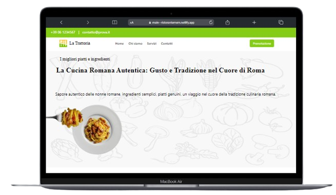
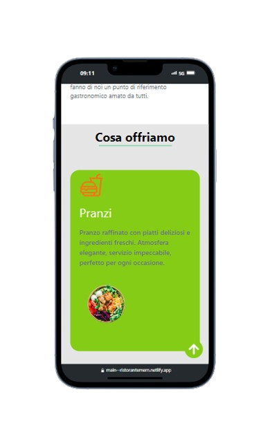

## 01-Progetto Ristorante con Stack MERN ##

  
  
   

### Links: ### 
**GitHub Repository/ Codice:** [Progetto Ristorante Stack MERN](https://github.com/StefanHritcu/Progetto-Ristorante-Stack-MERN) **Qui troverai la descrizione completa**

**Link del sito con Netlify:** (https://main--ristorantemern.netlify.app/).

### Descrizione: ### 
Un'applicazione per la gestione di un ristorante sviluppata con lo stack MERN (MongoDB, Express.js, React, Node.js). I clienti possono effettuare prenotazioni online, mentre i dipendenti e il proprietario del ristorante hanno accesso a una dashboard per gestire le prenotazioni e altre funzionalità operative.

### Tecnologie utilizzate: ### 

- **Frontend:** React, JavaScript/ES6+, HTML, CSS/TAILWIND.CSS
- **Backend:** Node.js, Express.js, MongoDB
- **Deployment:** Netlify (solo lato frontend)
Requisiti
Node.js (versione 14 o superiore)
MongoDB (versione 4 o superiore)

Installazione
Clonare il repository
git clone https://github.com/tuo-username/ristorante-mern.git
cd ristorante-mern
Configurare le variabili d'ambiente
Crea un file .env nella directory principale del progetto e aggiungi le seguenti variabili:
MONGO_URI=your_mongodb_connection_string
JWT_SECRET=your_jwt_secret

Installare le dipendenze

Backend
cd server
npm install

Frontend
cd client
npm install

Avvio del Progetto

Avviare il Server
npm start

Avviare il Client
cd client
npm run dev

Accesso all'Admin
Per accedere alla dashboard dell'admin, inserire nell url /admin123 o /admindashboard per saltare direttamente il login/registrazione e accedere direttamente alla dashboard

ps usare POSTMAN nel caso si volesse provare le api del backend
